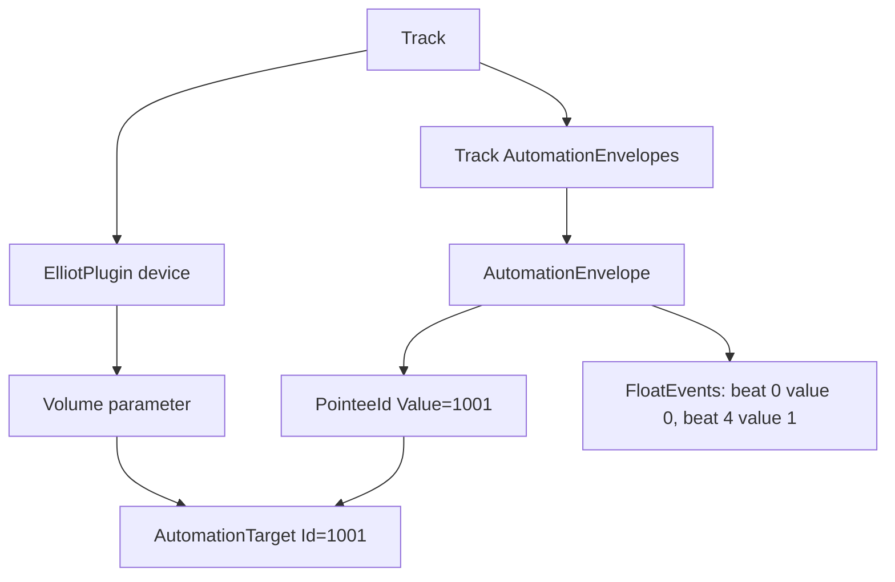

# Ableton Automation XML Notes

This is a handoff note for the hardware-live converter work. The short version:
automation copying is doable for the Tetra/Moog conversion, but it should be
treated as a constrained Ableton XML migration problem, not as a general-purpose
Ableton editor.

## Mental Model

Arrangement automation is stored as a relationship between two pieces of XML:

- an automatable parameter owns an `AutomationTarget Id`;
- the track owns an `AutomationEnvelope` whose `EnvelopeTarget/PointeeId` points
  at that target id.

For a simple plugin named `ElliotPlugin` with a `Volume` parameter automated from
minimum to maximum over one measure, the simplified XML shape is:

```xml
<PluginDevice Id="3">
  <Name Value="ElliotPlugin" />
  <PluginFloatParameter Id="0">
    <ParameterName Value="Volume" />
    <ParameterValue>
      <Manual Value="0" />
      <AutomationTarget Id="1001">
        <LockEnvelope Value="0" />
      </AutomationTarget>
    </ParameterValue>
  </PluginFloatParameter>
</PluginDevice>

<AutomationEnvelopes>
  <Envelopes>
    <AutomationEnvelope Id="0">
      <EnvelopeTarget>
        <PointeeId Value="1001" />
      </EnvelopeTarget>
      <Automation>
        <Events>
          <FloatEvent Id="0" Time="0" Value="0" />
          <FloatEvent Id="1" Time="4" Value="1" />
        </Events>
      </Automation>
    </AutomationEnvelope>
  </Envelopes>
</AutomationEnvelopes>
```

The red arrangement automation line is the `AutomationEnvelope`. There is
normally zero or one arrangement automation envelope per automatable parameter
on a track. Clip envelopes and clip modulation are separate structures and
should not be mixed into this model without a separate pass.



## Copying Automation Safely

When copying a plugin/device chain, it is not enough to make target ids unique.
The copied envelopes must be moved to the new owning track and rewired to the
new target ids.

Original:

```text
ElliotPlugin.Volume AutomationTarget Id=1001
AutomationEnvelope PointeeId=1001
```

Good copy:

```text
Copied ElliotPlugin.Volume AutomationTarget Id=2407
Copied AutomationEnvelope PointeeId=2407
```

Bad copy:

```text
Copied ElliotPlugin.Volume AutomationTarget Id=2407
Copied AutomationEnvelope PointeeId=1001
```

The bad copy either still controls the old plugin, points nowhere meaningful, or
creates a corrupt/ambiguous set depending on the surrounding XML.

The current Tetra experiment follows this algorithm:

1. Build the generated `TetraLive` track.
2. Copy the old Tetra group devices onto `TetraLive`.
3. Remap copied global target ids and keep the old-to-new id map.
4. Read the old Tetra group `AutomationEnvelopes`.
5. Copy only envelopes where every `PointeeId` exists in the old-to-new map.
6. Rewrite those `PointeeId` values through the map.
7. Insert the rewritten envelopes into `TetraLive`.
8. Validate that every copied envelope points at a target id present on
   `TetraLive`.

For `resignation1_mix.als`, the proof case was:

```text
Old Tetra group:
  Ghz Panpot 3 / Master Pan target id = 72651
  Automation envelope points to 72651
  Envelope has 9 FloatEvent points

Generated TetraLive:
  Copied Ghz Panpot 3 / Master Pan target id = 79263
  Copied automation envelope points to 79263
  Envelope still has 9 FloatEvent points
```

## Desired Code Shape

The current code is split by responsibility, but it is still mostly procedural
XML surgery:

- `ableton_utilities/live_set.py`: generic XML helpers, validation, and target id
  remapping.
- `ableton_utilities/hardware_xml.py`: builds generated live tracks.
- `ableton_utilities/hardware/automation.py`: copies mapped Tetra automation
  envelopes.

Before expanding this beyond the narrow Tetra experiment, introduce a small
semantic layer so the code reflects the Ableton model directly.

Suggested objects:

```python
class TrackXml:
    name: str
    track_id: int
    xml: str

    def target_ids(self) -> set[str]: ...
    def automation_envelopes(self) -> list[AutomationEnvelopeXml]: ...
    def direct_devices(self) -> list[DeviceXml]: ...
    def replace_direct_devices(self, devices: list[DeviceXml]) -> "TrackXml": ...
    def copy_mapped_automation_from(
        self,
        source: "TrackXml",
        target_map: "TargetIdMap",
    ) -> "TrackXml": ...


class AutomationEnvelopeXml:
    xml: str

    def pointee_ids(self) -> list[str]: ...
    def rewrite_pointees(self, target_map: "TargetIdMap") -> "AutomationEnvelopeXml": ...
    def is_fully_mapped_by(self, target_map: "TargetIdMap") -> bool: ...


class TargetIdMap:
    old_to_new: dict[str, str]

    def has_old(self, target_id: str) -> bool: ...
    def rewrite(self, target_id: str) -> str: ...
```

The converter should then read more like:

```python
source_group = TrackXml.from_block(tetra_group_block)
target_track = TrackXml.from_block(generated_tetra_live_block)

target_track, target_map = target_track.remap_global_targets(first_id)
target_track = target_track.copy_mapped_automation_from(source_group, target_map)
target_track.validate_automation_targets()
```

This would make the intended behavior obvious:

- tracks own arrangement automation envelopes;
- parameters own automation targets;
- target id remapping produces a first-class map;
- automation copying is a map-and-validate operation, not a blind string copy.

## Validation Rules

At minimum, any generalized version should validate:

- every copied `AutomationEnvelope` points to a target id present in its owning
  track;
- every copied global target id is unique where Ableton expects uniqueness;
- `NextPointeeId` is greater than the copied/remapped target ids;
- copied envelopes keep valid event timing, especially no invalid first event
  time;
- the generated set opens in Ableton and can be saved once as a normalization
  pass.

Do not broaden this to nested racks, clip modulation, Max devices, or arbitrary
device-chain surgery until the object layer above exists and has focused tests.
