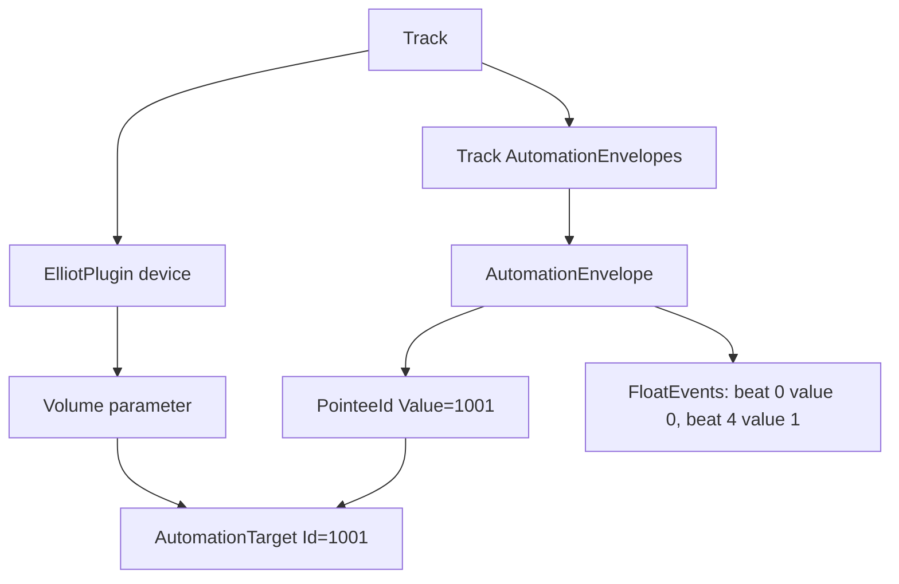

# Ableton Automation XML Notes

Handoff notes for the hardware-live converter. Automation copying is practical
for the Tetra/Moog case, but it should stay a constrained migration, not a
general Ableton XML editor.

## Mental Model

Arrangement automation is split across two XML locations:

- the automatable parameter owns an `AutomationTarget Id`;
- the track owns an `AutomationEnvelope` whose `EnvelopeTarget/PointeeId`
  points at that target id.

Simplified example: `ElliotPlugin.Volume` automates from minimum to maximum over
one measure.

```xml
<PluginDevice Id="3">
  <Name Value="ElliotPlugin" />
  <PluginFloatParameter Id="0">
    <ParameterName Value="Volume" />
    <ParameterValue>
      <Manual Value="0" />
      <AutomationTarget Id="1001" />
    </ParameterValue>
  </PluginFloatParameter>
</PluginDevice>

<AutomationEnvelope Id="0">
  <EnvelopeTarget>
    <PointeeId Value="1001" />
  </EnvelopeTarget>
  <Automation>
    <Events>
      <FloatEvent Id="0" Time="0" Value="0" />
      <FloatEvent Id="1" Time="4" Value="1" />
    </Events>
  </Automation>
</AutomationEnvelope>
```

The red arrangement line is the `AutomationEnvelope`. In arrangement view there
is normally zero or one envelope per automatable parameter on a track. Clip
envelopes and clip modulation are different structures and should be handled by
a separate pass.



## Safe Copy Algorithm

When copying a plugin/device chain, unique ids are not enough. The copied
envelopes must move to the new owning track and point at the copied parameters'
new target ids.

```text
Original: ElliotPlugin.Volume target 1001, envelope points to 1001
Good copy: copied target 2407, copied envelope points to 2407
Bad copy: copied target 2407, copied envelope still points to 1001
```

The current Tetra path does this:

1. Build `TetraLive`.
2. Copy old Tetra group devices onto `TetraLive`.
3. Remap copied global target ids and keep the old-to-new id map.
4. Copy only old group envelopes whose `PointeeId` values all exist in that map.
5. Rewrite copied `PointeeId` values through the map.
6. Insert the rewritten envelopes into `TetraLive`.
7. Renumber copied envelopes and validate the full set XML.

Proof case from `resignation1_mix.als`:

```text
Old Tetra group:
  Ghz Panpot 3 / Master Pan target id = 72651
  envelope points to 72651, with 9 FloatEvent points

Generated TetraLive:
  copied target id = 79263
  copied envelope points to 79263, still with 9 FloatEvent points
```

## Desired Future Shape

The code is now split by responsibility, but it is still procedural XML surgery:

- `ableton_utilities/live_set.py`: generic XML helpers, validation, and id
  remapping.
- `ableton_utilities/hardware_xml.py`: generated live tracks.
- `ableton_utilities/hardware/automation.py`: mapped Tetra automation copying.

Before broadening this beyond the Tetra proof case, add a small semantic layer:

- `TrackXml`: name/id/block, direct devices, automation envelopes, target ids.
- `AutomationEnvelopeXml`: pointee ids, fully-mapped check, pointee rewrite.
- `TargetIdMap`: old-to-new target lookup and rewrite.

The intended flow should read like:

```python
target_track, target_map = target_track.remap_global_targets(first_id)
target_track = target_track.copy_mapped_automation_from(source_group, target_map)
target_track.validate_automation_targets()
```

Minimum validation for any generalized version:

- every copied envelope points to a target id present on its owning track;
- every copied global target id is unique where Ableton expects uniqueness;
- `NextPointeeId` is greater than copied/remapped target ids;
- copied event timing remains valid;
- the generated set opens in Ableton and can be saved once as normalization.

Do not broaden this to nested racks, clip modulation, Max devices, or arbitrary
device-chain surgery until that object layer exists and has focused tests.
